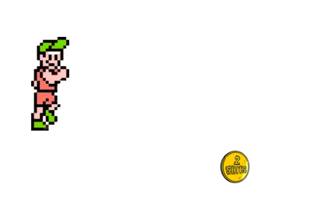

# Game Description
 
The game is based on randomly moving coin on the page considering the width and height of the window, as well as on the avatar's walk and his hitting of coins. When an avatar hits a coin, his score increases by one. The game ends when the avatar hits the coin 10 times, with the ‘Play Again’ button appearing.

# Built with

Game is built with pure HTML, CSS and JS, without CanvasJS.

 

